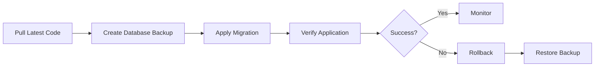

# EF Core Migration Strategy
## Patient Management Application

**Version:** 1.0  
**Last Updated:** May 20, 2026  
**Status:** Production Ready

---

## Table of Contents

1. [Overview](#overview)
2. [Migration Workflow](#migration-workflow)
3. [Creating Migrations](#creating-migrations)
4. [Applying Migrations](#applying-migrations)
5. [Rollback Procedures](#rollback-procedures)
6. [Best Practices](#best-practices)
7. [Troubleshooting](#troubleshooting)

---

## Overview

The Patient Management Application uses **Entity Framework Core Code-First** approach with migrations to manage database schema changes. This document outlines the strategy for creating, applying, and rolling back database migrations safely.

### Key Principles

- **Code-First**: Database schema is derived from domain entities
- **Version Controlled**: All migrations are committed to source control
- **Incremental**: Changes are applied incrementally, never modified after deployment
- **Reversible**: Every migration includes both `Up` and `Down` methods
- **Tested**: Migrations are tested in development before production deployment

---

## Migration Workflow

### Development Environment


### Production Environment



---

## Creating Migrations

### Prerequisites

1. Install EF Core tools globally:
   ```powershell
   dotnet tool install --global dotnet-ef
   dotnet tool update --global dotnet-ef
   ```

2. Verify installation:
   ```powershell
   dotnet ef --version
   ```

### Creating a New Migration

1. **Navigate to solution root**:
   ```powershell
   cd D:\Projects\BRD
   ```

2. **Create migration**:
   ```powershell
   dotnet ef migrations add <MigrationName> `
       --project src\PatientManagement.Infrastructure `
       --startup-project src\PatientManagement.API `
       --context ApplicationDbContext `
       --output-dir Data\Migrations
   ```

3. **Naming Conventions**:
   - Use descriptive PascalCase names
   - Include action and entity: `AddPatientPhoneNumber`
   - For schema changes: `AlterConsultationVitalsColumn`
   - For indexes: `CreateIndexOnPatientName`

   **Examples**:
   ```
   ✓ AddPrescriptionDosageField
   ✓ CreateIndexOnAppointmentDate
   ✓ AlterPatientAddressToOwnedType
   ✗ UpdateDatabase
   ✗ Changes2024
   ```

### Review Generated Migration

After creating a migration, **always review** the generated code:

```csharp
// src/PatientManagement.Infrastructure/Data/Migrations/<timestamp>_<MigrationName>.cs

public partial class AddPrescriptionDosageField : Migration
{
    protected override void Up(MigrationBuilder migrationBuilder)
    {
        // Forward migration - verify SQL is correct
        migrationBuilder.AddColumn<string>(
            name: "Dosage",
            table: "Prescriptions",
            type: "nvarchar(100)",
            maxLength: 100,
            nullable: false,
            defaultValue: "");
    }

    protected override void Down(MigrationBuilder migrationBuilder)
    {
        // Rollback migration - verify data loss implications
        migrationBuilder.DropColumn(
            name: "Dosage",
            table: "Prescriptions");
    }
}
```

### Verification Checklist

- [ ] Migration name is descriptive
- [ ] `Up` method contains correct schema changes
- [ ] `Down` method correctly reverses changes
- [ ] No data loss in rollback (or documented if unavoidable)
- [ ] Default values set for new non-nullable columns
- [ ] Indexes created for foreign keys and frequently queried columns
- [ ] No breaking changes to existing data

---

## Applying Migrations

### Local Development

```powershell
# Apply all pending migrations
dotnet ef database update `
    --project src\PatientManagement.Infrastructure `
    --startup-project src\PatientManagement.API `
    --context ApplicationDbContext

# Apply to specific migration
dotnet ef database update <MigrationName> `
    --project src\PatientManagement.Infrastructure `
    --startup-project src\PatientManagement.API
```

### Production Deployment

**Automated (Recommended)**:

Migrations are applied automatically during deployment via `docker-compose`:

```yaml
# In .github/workflows/deploy.yml
- name: Apply Migrations
  run: |
    docker-compose run --rm api \
      dotnet ef database update \
      --project /src/src/PatientManagement.Infrastructure \
      --startup-project /src/src/PatientManagement.API
```

**Manual (Emergency)**:

```powershell
# 1. Create backup FIRST
.\scripts\backup-database.ps1

# 2. Apply migration
dotnet ef database update `
    --project src\PatientManagement.Infrastructure `
    --startup-project src\PatientManagement.API `
    --connection "Server=<production-server>;Database=PatientManagementDb;..."

# 3. Verify application functionality
curl https://your-api-url/health
```

### Generate SQL Script (Review Before Applying)

```powershell
# Generate idempotent SQL script
dotnet ef migrations script `
    --project src\PatientManagement.Infrastructure `
    --startup-project src\PatientManagement.API `
    --output migrations-script.sql `
    --idempotent

# Review script before applying to production
code migrations-script.sql
```

---

## Rollback Procedures

### Scenario 1: Rollback Immediately After Deployment

**If migration causes issues in production:**

1. **Use automated rollback script**:
   ```powershell
   .\scripts\migration-rollback.ps1 -TargetMigration PreviousMigrationName
   ```

2. **Or manual rollback**:
   ```powershell
   dotnet ef database update PreviousMigrationName `
       --project src\PatientManagement.Infrastructure `
       --startup-project src\PatientManagement.API
   ```

3. **Verify database state**:
   ```powershell
   dotnet ef migrations list `
       --project src\PatientManagement.Infrastructure `
       --startup-project src\PatientManagement.API
   ```

### Scenario 2: Rollback After Data Modifications

**If data has been modified after migration:**

1. **Stop application**:
   ```powershell
   docker-compose down
   ```

2. **Restore database from backup**:
   ```powershell
   .\scripts\restore-database.ps1 -BackupFile ".\backups\pre-deployment-backup.bak"
   ```

3. **Deploy previous application version**:
   ```powershell
   git checkout <previous-commit>
   docker-compose up -d
   ```

### Scenario 3: Rollback to Initial State

**Complete database reset (USE WITH CAUTION)**:

```powershell
# Rollback all migrations
dotnet ef database update 0 `
    --project src\PatientManagement.Infrastructure `
    --startup-project src\PatientManagement.API

# Re-apply all migrations
dotnet ef database update `
    --project src\PatientManagement.Infrastructure `
    --startup-project src\PatientManagement.API
```

---

## Best Practices

### 1. Always Create Backups Before Migrations

```powershell
# Pre-deployment backup (automated in CI/CD)
.\scripts\backup-database.ps1 -BackupPath .\backups\pre-deployment
```

### 2. Test Migrations in Staging Environment

- Apply migrations to staging database first
- Run full test suite
- Verify application functionality
- Only then deploy to production

### 3. Use Idempotent Scripts for Production

```powershell
# Generate idempotent script
dotnet ef migrations script --idempotent -o deploy-script.sql

# This script can be run multiple times safely
sqlcmd -S ProductionServer -d PatientManagementDb -i deploy-script.sql
```

### 4. Never Modify Existing Migrations

**❌ Don't Do This**:
```csharp
// Modifying an already-deployed migration
public override void Up(MigrationBuilder migrationBuilder)
{
    // Changed from nvarchar(100) to nvarchar(200) - WRONG!
    migrationBuilder.AlterColumn<string>(...);
}
```

**✓ Do This Instead**:
```csharp
// Create a new migration
dotnet ef migrations add ExtendPrescriptionDosageLength
```

### 5. Document Breaking Changes

Add comments to migrations with breaking changes:

```csharp
/// <summary>
/// BREAKING CHANGE: Removes legacy 'OldFieldName' column.
/// Data migration: Copy values to 'NewFieldName' before applying.
/// Rollback impact: Data in 'NewFieldName' will be lost.
/// </summary>
public partial class RemoveLegacyField : Migration
{
    // ...
}
```

### 6. Use Data Migration for Complex Changes

For schema changes requiring data transformation:

```csharp
protected override void Up(MigrationBuilder migrationBuilder)
{
    // 1. Add new column
    migrationBuilder.AddColumn<string>("NewField", "Patients", nullable: true);
    
    // 2. Migrate data (use raw SQL for complex transformations)
    migrationBuilder.Sql(@"
        UPDATE Patients 
        SET NewField = CONCAT(OldField1, ' ', OldField2)
        WHERE NewField IS NULL
    ");
    
    // 3. Make column non-nullable
    migrationBuilder.AlterColumn<string>("NewField", "Patients", nullable: false);
    
    // 4. Drop old columns
    migrationBuilder.DropColumn("OldField1", "Patients");
    migrationBuilder.DropColumn("OldField2", "Patients");
}
```

---

## Troubleshooting

### Issue 1: "Migration Already Applied"

**Error**:
```
The migration '20240520_AddField' has already been applied to the database.
```

**Solution**:
```powershell
# List applied migrations
dotnet ef migrations list

# Create a new migration instead
dotnet ef migrations add AddFieldV2
```

### Issue 2: "Pending Model Changes"

**Error**:
```
Your current model has changes that are not reflected in a migration.
```

**Solution**:
```powershell
# Create migration for pending changes
dotnet ef migrations add SyncPendingChanges

# Or discard model changes and revert code
git checkout src/PatientManagement.Domain/Entities/
```

### Issue 3: "Cannot Drop Column - Referenced by Foreign Key"

**Error**:
```
Cannot drop column 'PatientId' because it is referenced by foreign key constraint.
```

**Solution**:
```csharp
protected override void Up(MigrationBuilder migrationBuilder)
{
    // 1. Drop foreign key first
    migrationBuilder.DropForeignKey("FK_Appointments_Patients", "Appointments");
    
    // 2. Drop column
    migrationBuilder.DropColumn("PatientId", "Appointments");
    
    // 3. Recreate with new structure
    migrationBuilder.AddColumn<int>("PatientId", "Appointments", ...);
    migrationBuilder.AddForeignKey(...);
}
```

### Issue 4: "Migration Script Too Large"

**Error**:
```
Migration script exceeds maximum length.
```

**Solution**:
```powershell
# Split into multiple smaller migrations
dotnet ef migrations add Part1_AddTables
dotnet ef migrations add Part2_AddIndexes
dotnet ef migrations add Part3_AddData
```

### Issue 5: "Database Connection Timeout During Migration"

**Error**:
```
Timeout expired. The timeout period elapsed before completion.
```

**Solution**:
```powershell
# Increase command timeout
dotnet ef database update --command-timeout 600

# Or apply via SQL script
dotnet ef migrations script -o script.sql
sqlcmd -S Server -d DB -i script.sql -t 600
```

---

## Emergency Procedures

### Complete Database Restore

1. **Stop application**:
   ```powershell
   docker-compose down
   ```

2. **Restore from backup**:
   ```powershell
   .\scripts\restore-database.ps1 `
       -BackupFile ".\backups\PatientManagementDb_YYYYMMDD_HHMMSS.bak" `
       -Force
   ```

3. **Verify database integrity**:
   ```sql
   DBCC CHECKDB(PatientManagementDb) WITH NO_INFOMSGS;
   ```

4. **Restart application**:
   ```powershell
   docker-compose up -d
   ```

5. **Monitor logs**:
   ```powershell
   docker-compose logs -f api
   ```

---

## Migration Checklist

### Pre-Deployment

- [ ] Migration created with descriptive name
- [ ] Migration code reviewed
- [ ] `Up` and `Down` methods verified
- [ ] Migration tested in local environment
- [ ] Migration tested in staging environment
- [ ] Database backup created
- [ ] Breaking changes documented
- [ ] Team notified of deployment window

### During Deployment

- [ ] Application stopped (if required)
- [ ] Pre-deployment backup verified
- [ ] Migration applied successfully
- [ ] Application started
- [ ] Health check passed
- [ ] Smoke tests passed

### Post-Deployment

- [ ] Application functionality verified
- [ ] Database performance monitored
- [ ] Logs reviewed for errors
- [ ] Post-deployment backup created
- [ ] Team notified of completion
- [ ] Migration marked as deployed in tracking system

---

## References

- [EF Core Migrations Documentation](https://docs.microsoft.com/en-us/ef/core/managing-schemas/migrations/)
- [Deployment Guide](./DEPLOYMENT_GUIDE.md)
- [Disaster Recovery Plan](./DISASTER_RECOVERY.md)

---

**Document Owner:** Development Team  
**Review Frequency:** Quarterly or after major schema changes  
**Next Review Date:** August 20, 2026
